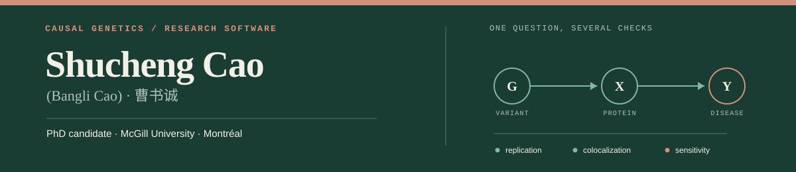
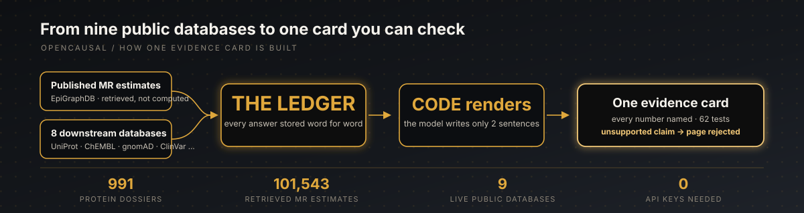
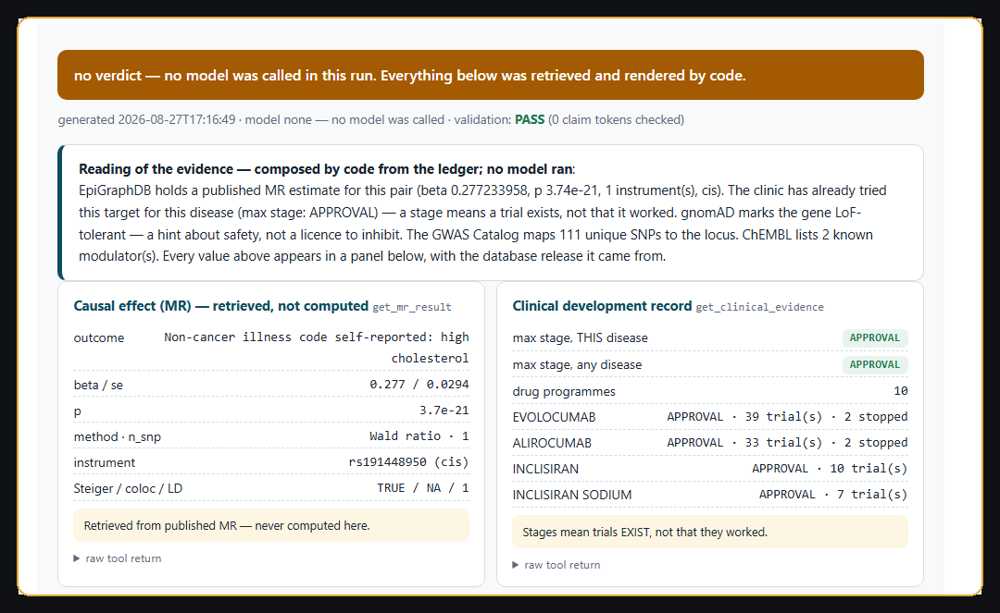

  

  
  
  
  
  
  

I use human-genetics evidence to separate true causal drivers from noise, and I build LLM agents that turn public databases into cited, decision-ready evidence for drug targets.

<table>
  <tr>
    <td width="33%" valign="top">
      <strong>🧬 The science</strong>  
      Causal genetics of obesity 
      and metabolic disease 
      Butler-Laporte lab, McGill
    </td>
    <td width="33%" valign="top">
      <strong>🎯 The method</strong>  
      Mendelian randomization 
      + colocalization 
      proteome-wide, to nominate and de-risk targets
    </td>
    <td width="34%" valign="top">
      <strong>🤖 What I build</strong>  
      LLM tool-calling agents 
      over public databases 
      evidence you can check, line by line
    </td>
  </tr>
</table>

## Featured project

### [CausalSentinel / OpenCausal](https://github.com/shuchengcaoxin/CausalSentinel)

**Type a protein and a disease. Get back one evidence card you can check, line by line.**

  

- The card is rendered by code, not written by the model
- The model writes two sentences — a validator rejects the page if either is unsupported
- Benchmarked on 20 pairs history already decided: every GO was a drug that launched
- MR estimates are always *retrieved*, never computed here

  

**[Explore repository →](https://github.com/shuchengcaoxin/CausalSentinel)** &nbsp;&nbsp; **[Browse 991 protein dossiers →](https://ds4cabs.github.io/CausalSentinel/dossiers/)** &nbsp;&nbsp; **[Card viewer →](https://ds4cabs.github.io/CausalSentinel/viewer/)**

Built as the core of the CABS 2026 team project · <a href="https://github.com/ds4cabs/CausalSentinel">upstream repo</a>, alongside Natalie Huang's OpenSentinel drug-safety module.

## Background

<table>
  <tr>
    <td width="33%" valign="top">
      <strong>McGill University</strong>  
      PhD candidate, Quantitative Life Sciences 
      Drug-target discovery · graduating 2027
    </td>
    <td width="33%" valign="top">
      <strong>KAUST</strong>  
      MSc 
      Thesis ranked in the year's top ten
    </td>
    <td width="34%" valign="top">
      <strong>CABS</strong>  
      Data Science Summer Intern, 2026 
      Built a drug-target agent end to end; mentored a teammate to a working one
    </td>
  </tr>
</table>

Recent: *Nature Communications* (accepted, 2026) · *Advanced Science* (2023) · *IEEE TPAMI* (2021) · ESHG 2026 poster, Gothenburg — proteome-wide causal inference for metabolic liver disease

## Toolkit

`Python` · `R` · `Bash` · `Git` · Mendelian randomization · colocalization · GWAS / pQTL · LLM agents · RAG · tool calling

  

## Connect

[Website](https://shuchengcaoxin.github.io) · [Google Scholar](https://scholar.google.com/citations?user=q1cAyE0AAAAJ&hl=en) · [LinkedIn](https://www.linkedin.com/in/shucheng-bangli-cao/) · [ResearchGate](https://www.researchgate.net/profile/Shucheng-Cao) · [Email](mailto:shucheng.cao@mail.mcgill.ca)

Graduating 2027 — open to roles where causal inference and large-scale statistical modelling drive real decisions.

